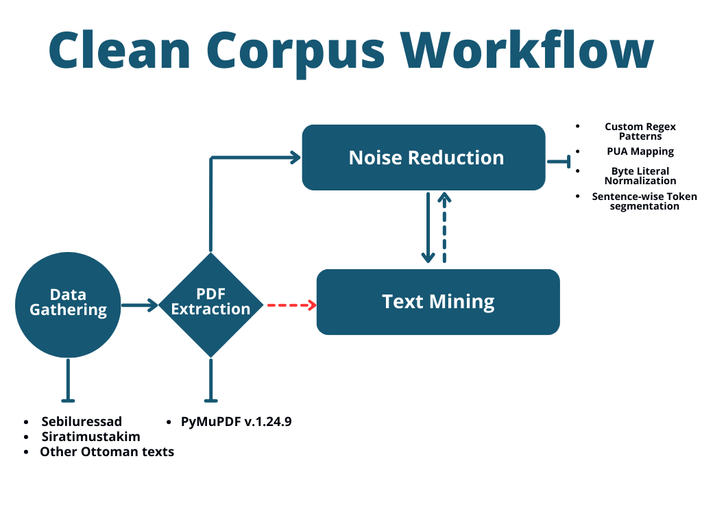

<p align="center">
  
  
</p>
<p align="center">
  <em>Ottoman NLP</em>
  &nbsp;&nbsp;&nbsp;&nbsp;&nbsp;&nbsp;&nbsp;&nbsp;&nbsp;&nbsp;&nbsp;&nbsp;&nbsp;&nbsp;&nbsp;&nbsp;&nbsp;&nbsp;&nbsp;&nbsp;&nbsp;&nbsp;&nbsp;&nbsp;
  <em>Boğaziçi BUCOLIN Lab</em>
</p>

# Ottoman NLP Toolkit

<p align="center">
  
</p>

## Project Overview

The Ottoman NLP Toolkit is a state-of-the-art computational linguistics project aimed at revolutionizing the processing and analysis of Ottoman Turkish texts. Developed by the BUCOLIN Lab at Boğaziçi University, this toolkit addresses the unique challenges posed by the Ottoman language's complex script and historical variations.



## Research Objectives

1. Develop advanced NLP techniques tailored for Ottoman Turkish
2. Create a comprehensive digital corpus of Ottoman texts
3. Facilitate linguistic and historical research through automated text analysis
4. Bridge the gap between classical Ottoman studies and modern computational methods

## Key Features and Methodologies

### 1. Corpus Management System
- **Version Control**: Git-based tracking for meticulous corpus evolution
- **Authorization Protocols**: Role-based access control for collaborative research
- **Metadata Management**: Comprehensive tagging system for efficient text categorization

### 2. Text Processing Pipeline
- **OCR Enhancement**: Custom algorithms for Ottoman script recognition
- **Normalization**: Standardization of orthographic variations
- **Tokenization**: Context-aware segmentation of Ottoman compounds

### 3. Advanced NLP Modules
- **Morphological Analysis**: Rule-based and ML approaches for Ottoman morphology
- **Named Entity Recognition**: Identification of historical figures, places, and events
- **Semantic Analysis**: Vector space modeling of Ottoman lexical semantics

### 4. T5 Formatter (New in v1.0.0)
- **Automated Text Structuring**: T5 model fine-tuned on Ottoman corpus
- **Supervised Learning**: Iterative improvement through expert feedback

### 5. Researcher Interface
- **Interactive Visualization**: Dynamic representation of linguistic patterns
- **Query System**: Complex search capabilities across the corpus
- **Annotation Tools**: Collaborative platform for scholarly markup

## Technical Specifications

- **Programming Languages**: Python 3.8+, C++ for performance-critical components
- **Machine Learning Frameworks**: PyTorch, TensorFlow
- **Database**: MongoDB for flexible document storage
- **Front-end**: React.js with D3.js for visualizations

## Installation and Setup

1. Clone the repository:
   ```bash
   git clone https://github.com/Ottoman-NLP/Ottoman_LLM_Repos.git
   cd Ottoman_NLP_Toolkit
   ```

2. Set up the environment:
   ```bash
   python -m venv venv
   source venv/bin/activate  # On Windows use `venv\Scripts\activate`
   pip install -r requirements.txt
   ```

3. Configure the database:
   ```bash
   python scripts/setup_database.py
   ```

4. Launch the application:
   ```bash
   python -m GUI.tk_main
   ```

## Usage Guidelines

Refer to our [comprehensive documentation](https://ottoman-nlp.readthedocs.io) for detailed usage instructions, API references, and best practices.

## Contributing

We welcome contributions from researchers and developers. Please consult our [Contribution Guidelines](CONTRIBUTING.md) for more information on how to submit pull requests, report issues, or suggest enhancements.

## Citing This Work

If you use the Ottoman NLP Toolkit in your research, please cite our paper:
<pre>
@inproceedings{karagoz2024towards,
title={Towards a Clean Text Corpus for Ottoman Turkish},
author={Karag{"o}z, Fatih Burak and Do{\u{g}}an, Berat and {"O}zate{\c{s}}, {\c{S}}aziye Bet{"u}l},
booktitle={Proceedings of the First Workshop on Natural Language Processing for Turkic Languages (SIGTURK 2024)},
pages={62},
year={2024},
month={August},
address={[Bangkok, Thailand]},
publisher={[ACL]}
}
</pre>

## License

This project is licensed under the Apache License 2.0 - see the [LICENSE](LICENSE) file for details.

## Acknowledgments

This research is supported by grants from the Turkish Scientific and Technological Research Council (TÜBİTAK) and the European Research Council (ERC).

---

© 2023 Ottoman NLP Project, Boğaziçi University. All rights reserved.